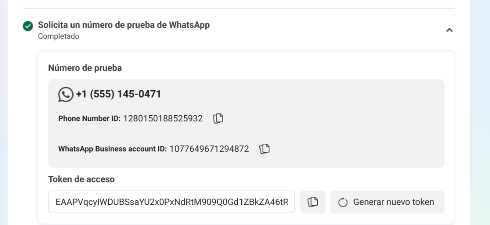
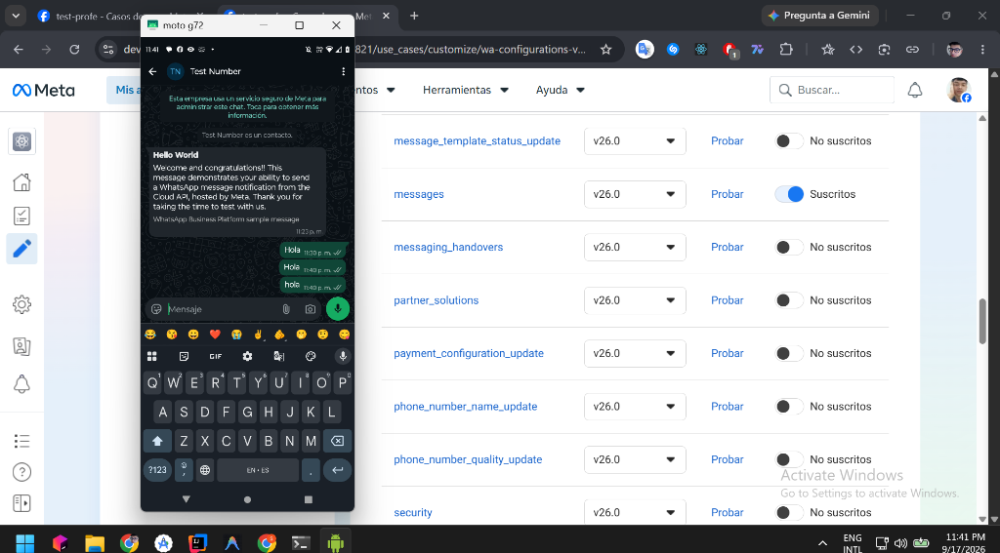
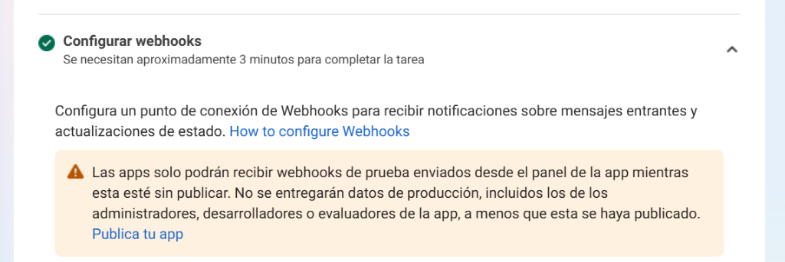
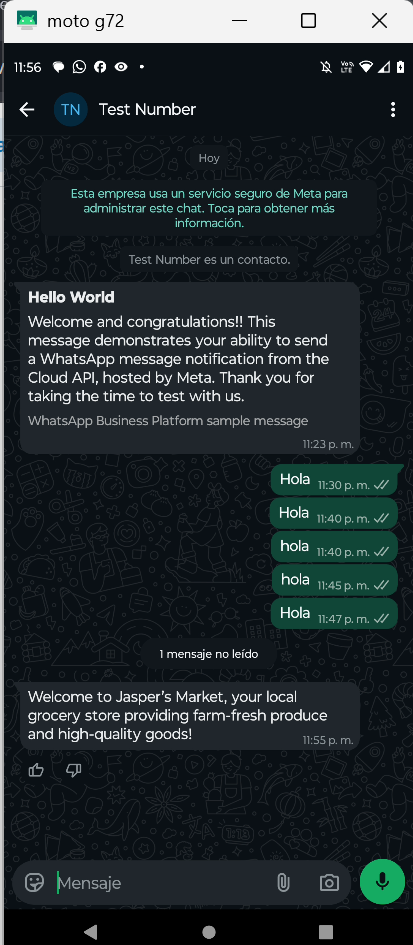
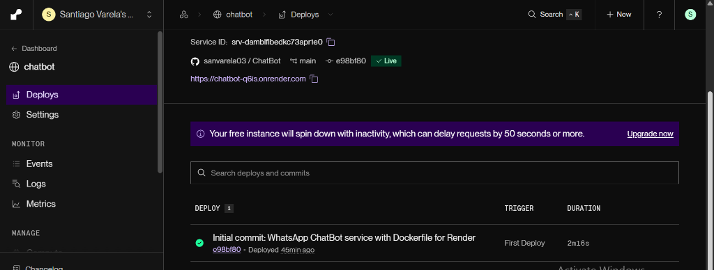

# 🤖 WhatsApp Cloud API ChatBot - Nexum

Servicio backend de mensajería y chatbot automatizado conectado a la **API de WhatsApp Cloud de Meta**, desarrollado con **Java 17**, **Spring Boot 3.4.4** y **Gradle**. Contenerizado con **Docker** y desplegado en alta disponibilidad en **Render** con optimizaciones de memoria mediante **Class Data Sharing (CDS)**.

---

## 🌐 Enlaces Clave del Proyecto

| Recurso | Enlace |
| :--- | :--- |
| **Repositorio GitHub** | [sanvarela03/ChatBot](https://github.com/sanvarela03/ChatBot) |
| **URL Pública (Render)** | [https://chatbot-q6is.onrender.com](https://chatbot-q6is.onrender.com) |
| **Documentación Swagger UI** | [https://chatbot-q6is.onrender.com/swagger-ui/index.html](https://chatbot-q6is.onrender.com/swagger-ui/index.html) |
| **Endpoint del Webhook** | `https://chatbot-q6is.onrender.com/webhook` |
| **Dashboard de Render** | [srv-damblflbedkc73apr1e0](https://dashboard.render.com/web/srv-damblflbedkc73apr1e0) |

---

## 📋 Configuración de Meta Developers & WhatsApp Cloud API

| Parámetro | Valor Configurado |
| :--- | :--- |
| **App ID en Meta** | `1079350187808821` |
| **Nombre de la App** | `test-profe` |
| **WhatsApp Business Account ID (WABA)** | `1077649671294872` |
| **Phone Number ID** | `1280150188525932` |
| **Número de teléfono de prueba** | `+1 (555) 145-0471` |
| **Callback URL del Webhook** | `https://chatbot-q6is.onrender.com/webhook` |
| **Verify Token del Webhook** | `MiPasswordBot123!` |
| **Evento / Campo suscrito** | `messages` (v26.0) |
| **Estado de vinculación WABA** | Vinculado (`/subscribed_apps` -> `success: true`) |

---

## 📸 Evidencias de Configuración y Pruebas

### 1. Configuración del Número de Prueba y Credenciales de Meta
Muestra el número de prueba asignado, el ID de número de teléfono y el ID de la cuenta comercial WABA:

---

### 2. Suscripción al Evento `messages` en el Webhook
Configuración activa del campo de mensajería `messages` para recibir notificaciones en tiempo real:

---

### 3. Prueba Exitosa de Webhook desde el Panel de Meta
Meta validó la entrega de eventos hacia el servidor en Render con código HTTP `200 OK`:

---

### 4. Recepción de Mensajes en WhatsApp Móvil
Entrega y visualización exitosa de mensajes enviados desde Meta Cloud API hacia el celular personal autorizado:

  

---

### 5. Despliegue en Vivo y Estado Saludable en Render
Panel de control de Render mostrando el servicio web en estado **Live**, conectado al repositorio de GitHub y el aviso de suspensión por inactividad (*spin down*) característico del plan gratuito:

---

## ⚙️ Variables de Entorno

El proyecto lee variables tanto de un archivo local `.env` (a través de `io.github.cdimascio:java-dotenv`) como de las variables de entorno del sistema operativo inyectadas por Render:

| Variable | Descripción | Ejemplo / Valor |
| :--- | :--- | :--- |
| `ACCESS_TOKEN_DE_META` | Token de acceso temporal o permanente de Meta Graph API | `EAAPVqcyIWDU...` |
| `ID_DE_TU_TELEFONO_DE_PRUEBA` | ID del número telefónico de WhatsApp Cloud | `1280150188525932` |
| `MI_TOKEN_SECRETO` | Token de verificación secreto configurado en el Webhook | `MiPasswordBot123!` |
| `PORT` | Puerto asignado por Render (por defecto 8080 en local) | `10000` en Render |

> ⚠️ **Nota de seguridad:** El archivo `.env` está estrictamente ignorado por [`.gitignore`](.gitignore) y [`.dockerignore`](.dockerignore) para evitar la filtración de credenciales al repositorio público.

---

## 🏗️ Arquitectura y Tecnologías

* **Lenguaje:** Java 17 (Eclipse Temurin)
* **Framework:** Spring Boot 3.4.4
* **Gestor de Construcción:** Gradle 9.7.1
* **Cliente HTTP:** Spring 3+ `RestClient` (no bloqueante, tipado)
* **Serialización:** Jackson Databind (`com.fasterxml.jackson.databind.JsonNode`)
* **Documentación:** SpringDoc OpenAPI 2.8.6 (Swagger UI 3.0 con `@Tag`, `@Operation`, `@Parameter`, `@ApiResponse`)
* **Contenedor:** Docker multi-etapa con:
  * Etapa 1: Compilación Gradle y resolución de dependencias offline.
  * Etapa 2: Precalentamiento de memoria RAM con **Class Data Sharing (CDS - `app.jsa`)**.
  * Etapa 3: Imagen ligera Alpine JRE ejecutada bajo usuario no-root (`spring:spring`).

---

## 💬 Flujo de Respuestas del Bot

El controlador [`WhatsAppWebhookController`](src/main/java/dev/santi/chatbot/controller/WhatsAppWebhookController.java) procesa los mensajes entrantes mediante un árbol de decisiones:

* **Palabras de saludo** (`"hola"`, `"buenos dias"`, `"buenas tardes"`):
  > *"¡Hola desde Spring Boot! 🤖 ¿En qué puedo ayudarte hoy?"*
* **Palabras de consulta** (`"precio"`, `"costo"`, `"planes"`):
  > *"Nuestros planes comienzan en $50 USD. Escribe 'soporte' para hablar con un humano."*
* **Agradecimientos / Despedidas** (`"gracias"`, `"adios"`, `"chao"`):
  > *"¡Un placer ayudarte! ¡Hasta pronto!"*
* **Cualquier otro texto:**
  > *"Lo siento, soy un bot básico. Escribe 'hola' para ver las opciones disponibles."*

---

## 🚀 Habilitar Respuestas Bidireccionales en Producción (Modo "En vivo")

Meta aplica una política de seguridad por la cual las apps en modo **"En desarrollo"** no transmiten mensajes enviados desde clientes externos al Webhook. Para habilitar que el bot responda automáticamente cuando los usuarios le escriban:

1. Ve a **Meta Developers** > Tu App (`1079350187808821`) > **Configuración de la app** > **Básica**.
2. Ingresa la URL en **Política de privacidad**:
   `https://chatbot-q6is.onrender.com/swagger-ui/index.html` (o `https://nexum.com/terms`).
3. Ingresa la misma URL en **Términos del servicio**.
4. Selecciona una **Categoría** (ej. *Negocios* o *Utilidades*).
5. Guarda los cambios y en la barra superior cambia el interruptor a **"En vivo"** (*Live Mode*).
